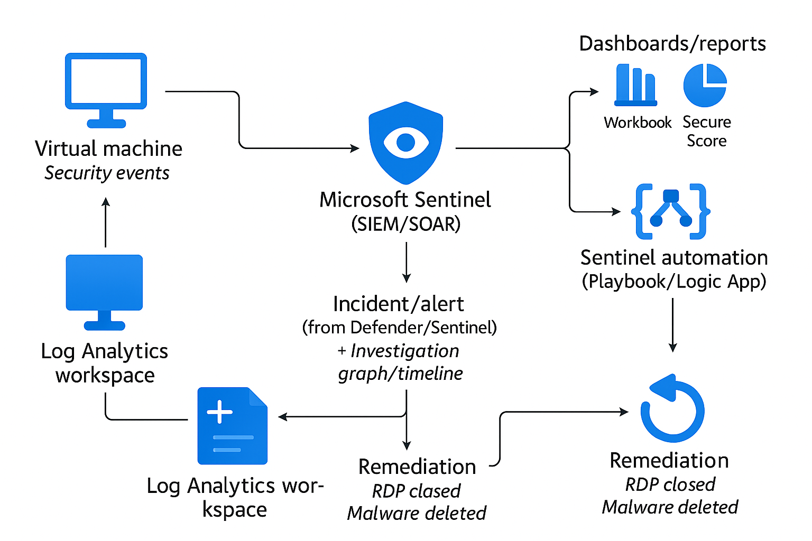

## Monitoring & Detection with Microsoft Sentinel & Defender for Cloud

End-to-end detection, response and remediation of cloud security incidents using Microsoft Sentinel SIEM/SOAR and Defender for Cloud.

---

## Table of Contents

- [Overview]
- [Real-World Risk]
- [What I Built]
- [Diagram]
- [Objectives]
- [Steps Performed]
  - [1. Resource Group & Workspace Setup]  
  - [2. Defender for Cloud & Sentinel Activation]  
  - [3. Agent & Data Connector Verification]  
  - [4. Threat Simulation]  
  - [5. Alert Detection & Incident Investigation]  
  - [6. Automated Incident Response]   
  - [7. Remediation & Secure Score]  
  - [8. Visualization]
  - [9. Cleanup]
  - [10. Additional Evidence]  
  - [11. Cleanup]
- [Screenshots]
- [Lessons Learned]
- [Post-Incident SOC Analysis]
- [Notes & Limitations]
- [References]

---

## Overview

This lab demonstrates real-world cloud blue team operations using Microsoft Sentinel and Defender for Cloud.  
I deployed a simulated SOC workflow—detecting threats, investigating alerts, triggering automated playbooks, remediating recommendations and visualizing posture in dashboards.  
**Bonus:** I exported Secure Score & recommendations and created a custom SOC-style post-incident analysis.

---

## Real-World Risk

- **Cloud attacks (malware, brute force, lateral movement) are fast-moving and persistent.**
- Lack of SIEM/SOAR means delayed detection, no alert correlation, and slow response.
- Automated detection and response are essential to minimize impact and prove compliance.

---

## What I Built

- Enabled Microsoft Defender for Cloud, activated Defender plans (including malware scanning, CSPM, and vulnerability management).
- Onboarded Microsoft Sentinel, connected to Log Analytics Workspace.
- Integrated built-in data connectors for Microsoft 365, Defender, VMs, and storage.
- Simulated real-world threats:
    - Uploaded the EICAR test file to storage (malware detection).
    - Performed RDP brute-force attempts against a lab VM.
- Configured custom Sentinel analytics rules (KQL) to detect brute-force logins.
- Built automated incident response using Sentinel Playbooks (Logic Apps) — triggered email notifications for new incidents.
- Remediated Defender for Cloud recommendations (e.g., closed open RDP, deleted malware, restricted NSG rules).
- Visualized alerts/incidents in Sentinel Workbooks dashboards.
- **Bonus:** Exported Secure Score & recommendations as CSV/PDF and created severity charts for documentation.

---

## Diagram

---

## Objectives

- Detect and investigate cloud threats in real-time using SIEM/SOAR (Sentinel, Defender for Cloud)
- Respond to incidents with automation (Logic Apps/Playbooks)
- Remediate misconfigurations, prove improved Secure Score.
- Visualize and report on cloud security posture for auditors/managers.

---

## Steps Performed

**1. Resource Group & Workspace Setup**  
   - Created a dedicated resource group and Log Analytics workspace for the lab *(Screenshot: resource-group-created.png & log-analytics-workspace.png)*

**2. Defender for Cloud & Sentinel Activation**  
   - Enabled Defender for Cloud plans (CSPM, workload protection, malware scanning)  
   - Enabled Microsoft Sentinel and connected Log Analytics workspace *(Screenshots: defender-for-cloud-enabled.png & azure-sentinel-enabled.png)*

**3. Agent & Data Connector Verification**  
   - Verified Log Analytics/AMA agent extension on VM.  
   - Confirmed Sentinel data connectors were active for all key sources *(Screenshots: agent-extension-present.png & sentinel-data-connectors.png)*

**4. Threat Simulation**  
   - Uploaded EICAR test file to Storage (malware simulation)  
   - Performed brute-force login attempts on VM (RDP, public IP)*(Screenshots: eicar-uploaded.png, rdp-blocked.png)*

**5. Alert Detection & Incident Investigation**  
   - Observed Defender for Cloud and Sentinel alerts for simulated threats.  
   - Explored Sentinel incident details, timeline, investigation graph, and entities involved *(Screenshots: defender-alerts.png, defender-alert-details.png, defender-alert-resolved.png, sentinel-incident-details.png, sentinel-incident-timeline.png, sentinel-investigation-graph.png & sentinel-entities.png)*

**6. Automated Incident Response (Playbooks)**  
   - Built Logic App playbook for automated email notification.  
   - Linked playbook to Sentinel automation rule and tested with simulated alerts *(Screenshots: logic-app-workflow-creation.png, logic-app-workflow-email-action.png, sentinel-logicapp-connection.png, sentinel-automation-rule.png & sentinel-bruteforce-email.png)*

**7. Remediation & Secure Score**  
   - Addressed open recommendations: closed RDP, deleted malware, restricted NSGs.  
   - Exported Secure Score/recommendations as CSV/PDF; visualized results with pie chart *(Screenshots: defender-recommendations.png, recommendation-unhealthy.png, recommendation-remediated.png & recommendations-severity-chart.png)*

**8. Visualization**  
   - Created Sentinel Workbook dashboard showing SOC/incident metrics *(Screenshot: workbook-dashboard.png)*

**9. Cleanup**  
   - Detached Sentinel, deleted lab resource group and resources to avoid Azure charges.

**10. Additional Evidence**  
   - Included key screenshots of log analytics workspace, storage account and VM details *(Screenshots: log-analytics-workspace.png, storage-account-overview.png, vm-overview.png, sentinel-custom-analytics-rule.png, auto-provisioning-agent-grayed.png)*

**11. Cleanup**

- Detached Microsoft Sentinel from the Log Analytics Workspace to stop SIEM/SOAR billing.
- Deleted all lab resources (VMs, Storage, Logic Apps, etc.) by removing the dedicated resource group in Azure Portal.
- Verified that no running VMs, Log Analytics Workspaces or other paid resources remained.
- Checked Azure Cost Management for leftover or hidden costs.

---

## Screenshots

*All screenshots are included in the screenshots/ folder.*

| Step | Filename                              | Description                                         |
|------|---------------------------------------|-----------------------------------------------------|
|  1   | resource-group-created.png            | Resource group and workspace creation for lab       |
|  2   | defender-for-cloud-enabled.png        | Defender for Cloud plans enabled                    |
|  2   | azure-sentinel-enabled.png            | Microsoft Sentinel enabled and connected            |
|  3   | agent-extension-present.png           | Log Analytics/AMA agent extension present on VM     |
|  3   | sentinel-data-connectors.png          | Sentinel data connectors overview                   |
|  4   | eicar-uploaded.png                    | EICAR test file uploaded to Azure Storage           |
|  4   | rdp-blocked.png                       | VM RDP blocked after brute-force simulation         |
|  5   | defender-alerts.png                   | Defender for Cloud alert detection                  |
|  5   | defender-alert-details.png            | Detailed Defender alert view                        |
|  5   | defender-alert-resolved.png           | Defender alert marked as resolved                   |
|  5   | sentinel-incident-details.png         | Sentinel incident details page                      |
|  5   | sentinel-incident-timeline.png        | Sentinel incident timeline view                     |
|  5   | sentinel-investigation-graph.png      | Sentinel incident investigation graph               |
|  5   | sentinel-entities.png                 | Entities involved in Sentinel incident              |
|  6   | logic-app-workflow-creation.png       | Logic App playbook (workflow) creation              |
|  6   | logic-app-workflow-email-action.png   | Playbook email action setup                         |
|  6   | sentinel-logicapp-connection.png      | Logic App connected in Sentinel automation rule     |
|  6   | sentinel-automation-rule.png          | Sentinel automation rule linked to playbook         |
|  6   | sentinel-bruteforce-email.png         | Automated email notification for brute-force alert  |
|  7   | defender-recommendations.png          | Defender for Cloud recommendations overview         |
|  7   | recommendation-unhealthy.png          | Unhealthy Defender recommendation before remediation|
|  7   | recommendation-remediated.png         | Defender recommendation after remediation (healthy) |
|  8   | workbook-dashboard.png                | Custom Sentinel Workbook dashboard                  |
|  8   | recommendations-severity-chart.png    | Pie chart: Recommendations by severity              |
|  9   | log-analytics-workspace.png           | Log Analytics workspace overview                    |
| 10   | storage-account-overview.png          | Storage account with security settings              |
| 10   | vm-overview.png                       | Azure VM overview/details                           |
| 11   | sentinel-custom-analytics-rule.png    | Custom analytics rule for brute-force detection     |
| 11   | auto-provisioning-agent-grayed.png    | Auto-provisioning agent status                      |

---

## Lessons Learned

- SIEM/SOAR in the cloud requires proper data source onboarding, analytics tuning and automated playbooks for effective defense.
- Hands-on detection and response (malware, brute force) builds true blue team skills.
- Remediation and Secure Score tracking prove continuous improvement to management/auditors.
- Visualization (workbooks, charts) make results actionable for SOC teams and leadership.

---

## Post-Incident SOC Analysis

**Incident:**  
- EICAR malware upload detected in storage (high-severity alert)
- Multiple failed RDP logins simulated from external IP.

**Detection & Investigation:**  
- Defender for Cloud and Sentinel both triggered on simulated threats.
- Incidents automatically created, investigated in timeline/graph and playbooks triggered.

**Response:**  
- Automated playbook sent instant email notification to SOC team.
- Blocked RDP access, deleted malicious file, refreshed recommendations.

**Outcome:**  
- All incidents resolved, recommendations remediated, Secure Score improved.
- Full detection, response, remediation and documentation cycle completed.

---

## Notes & Limitations

- Some brute-force alerts may require custom KQL analytics rules and ensuring SecurityEvent logs are ingested by Log Analytics.
- Real-world incidents may require additional forensics/investigation steps.
- Billing: Sentinel must be manually deactivated/removed from workspace after lab to avoid charges.

---

## References

- [Microsoft Sentinel Documentation](https://learn.microsoft.com/en-us/azure/sentinel/)
- [Defender for Cloud Docs](https://learn.microsoft.com/en-us/azure/defender-for-cloud/)
- [Azure Logic Apps (Playbooks)](https://learn.microsoft.com/en-us/azure/logic-apps/)
- [Microsoft Defender for Cloud](https://learn.microsoft.com/en-us/azure/defender-for-cloud/defender-for-cloud-introduction)
- [Kusto Query Language (KQL)](https://learn.microsoft.com/en-us/azure/data-explorer/kusto/query/)

---

Sebastian Silva C. – July 2025 – Berlin, Germany  
[LinkedIn](https://www.linkedin.com/in/sebastiansilc/) | [GitHub](https://github.com/SebaSilC)
